# Middle Earth

## Description

This website is a travel review website for the realm of Middle Earth. It reveals the risk level of main locations in Middle Earth, along with which creatures may be at the location and the inhabitants you can find within it.  

## Deployment link

https://middle-earth.up.railway.app/

##### Preview

## Timeframe & Working Team (Solo)

This was a 7-day solo project.

## Technologies Used

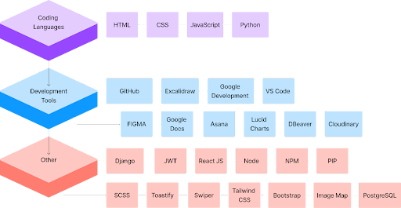
##### _Fig.1: Technologies used_

## Brief

The objective was to build a full-stack REST application using a Django Python back-end API, served by a PostgreSQL database and a ReactJS front-end. This was as part of General Assembly’s Software Engineering Immersive module 4 - Django. The website needed to also have CRUD capabilities.

## Planning

I initially began this project by brainstorming a few ideas which I found interesting. I love travelling but I wanted to create something a little different with some of my interests - leading to a travel review app set in Middle Earth (Lord of the Rings and Hobbit). 

The idea was to create a fun app reviewing the locations in Middle Earth as though they were real. 

Initially, I created a wire-frame using Excalidraw. This design was then cemented with some added styling using Figma - allowing me to play around with the styling of the website and really visualise how the end product would look.

To help to organise myself better and to keep a track of what needs to be done, what is being done, and what has been completed, I used the work management platform called Asana.

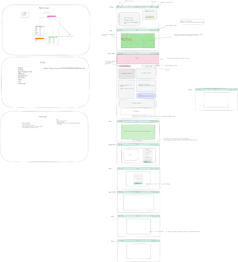
##### _Fig.2: Project Wireframe_

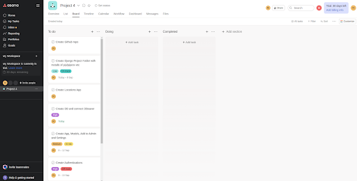
##### _Fig.3: Project Organisation_

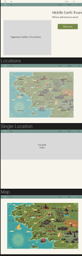
##### _Fig.4: Figma Planning_

I created an ERD using Lucidchart to help me to keep track of the relationships between the projects.

##### _Fig.5: ERD of Django Relationships_

Every day at 10 a.m. we would have a standup - which I enjoyed very much. I value stand-ups as it allows me to be open with my process and how I’m feeling so that others don’t feel alone. At the same time, it maintains a sense of cohesion with the team even when taking part in a solo project. This was also where the death of the Queen was discussed as it was a shocking event occurring during the project.

## Build Process

This project was completed in four phases:
Phase One: Back-end
Phase Two: Connecting back end to front end and pulling through data. Adding in registration and login.
Phase Three: Completing the CRUD requirements in the front end and establishing the MVP.
Phase Four: Adding styling and extra functionality/stretch goals.

### Phase One

To create the back-end I used Django. 
Relationships
Creating apps
Authentication
Models

Firstly I created a Git repository. Even though I was working alone I wanted to be able to use Git to have versions to fall back on should I run into any problems. As I understood Git from Project 3, I was confident in my ability to use it.

I used my ERD to create new apps using ‘django-admin startapp <app name>’ and connect them to the main app ‘location’ based on their relationships. As the reviews would have a one-to-one relationship I ensured that if the user was deleted, the reviews would also be deleted (fig.6). Due to this, the reviews were only attached to the user and then serialised onto the locations via the populated serializer rather than based within the model of the locations (fig.7). With the creatures and inhabitants, because their relationship was many-to-many, I placed them inside the locations model as they were directly linked (fig.8). I had to input all the apps into the project setting to connect them whilst ensuring each app has a model and each relationship has a view that would work as the ‘middleware’ allowing me to create endpoints. This also allowed me to create CRUD functionality. It’s within the middleware that I also check for authentication.

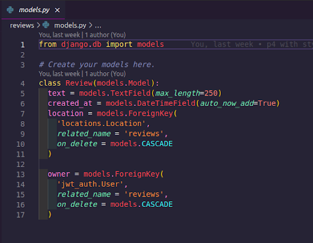
##### _Fig.6: Review model_

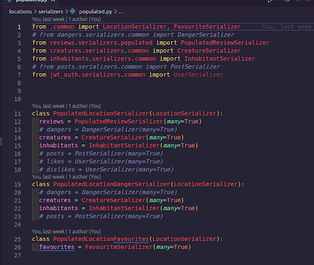
##### _Fig.7: Populated serializer with reviews_

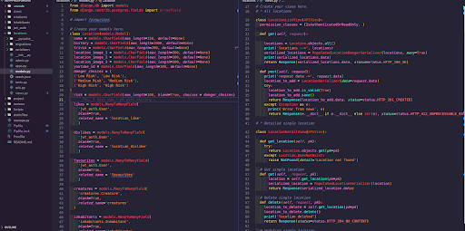
##### _Fig.8: Locations models and views_

### Phase Two

For this phase, I created the front-end app with React. I then created the main components by creating a new file for each section, importing them into the App.js, created new routes (pages) for each that required it, and then added the nav bar with Links to the pages to allow me to navigate properly. I also separated the styling documents for each page - using SASS - by importing all individual SCSS files into the main.scss file and then importing the main.scss file into the index.js. For the components that I didn’t need a page for, I made sure their functions were exported so that I didn’t need to import them into the App.js but rather only into the pages which required them (fig.9).

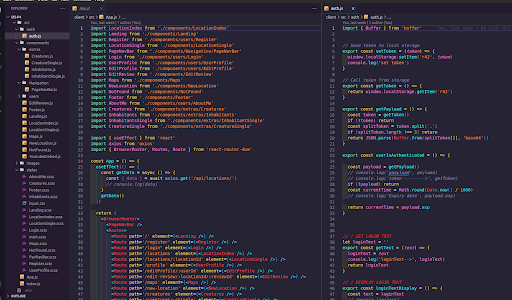
##### _Fig.9: Components_

I then started creating the registration, login, and logout pages/functions first. I didn’t have a problem with this section so it was seamless (fig.10).

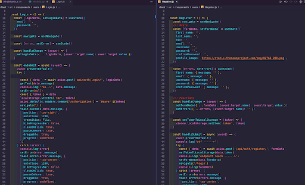
##### _Fig.10: Login and registration - front-end_

Insomnia and DBeaver were used to keep track of the data that was being input as the database was on PostgreSQL. 

Once the login, registration page, and logout functions were complete, I moved on to the location index page and single location pages. I wanted to start to pull in data from the database to ensure that everything was working as it should be. This was a relatively easy step within the phase (fig.11).

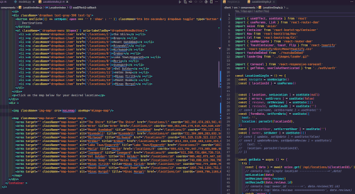
##### _Fig.11: Pulling in data into single location and image map on index page_

I then started to add the capabilities of CRUD for the reviews within the single location page. My experience from the previous project helped to accelerate this process although I ran into a problem that took up a lot of my time. The issue was that a ‘422’ error kept appearing when trying to post reviews  (see challenge one for more details). Once this was resolved, the other CRUD functionality for reviews soon followed. 

This was the moment that the MVP was met as I was able to pull in API information from my seeded data and had CRUD functionality. 

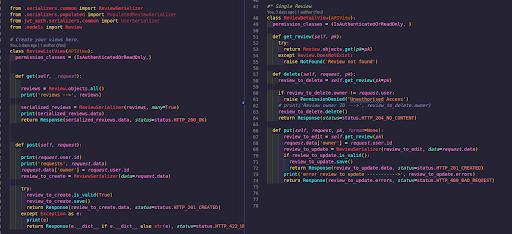
##### _Fig.12: Review views

### Phase Three

As the MVP was completed, I had a few stretch goals I wanted to complete for this project as I wanted to try to learn more about something I’d never done before. I went back into the back-end and input more views for the user (also known as the user controller - fig.13). This was because I wanted to be able to edit the user’s details, allowing them to change their password and upload new profile photos. This is also where I used Cloudinary. This was where I ran into another challenge where I was unable to upload profile photos which would then replace the profile images of the user (see challenge two for more details). By this stage, it was day 7 so I didn’t have time to add any more functionality before our presentations - as such I didn’t want to risk losing any data either so I started to focus on styling.

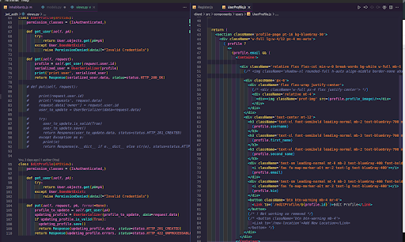
##### _Fig.13: User profile views/controller_

### Phase Four

By this point, I had met my MVP and a few of my stretch goals so I needed to focus on styling as I had less than a day remaining. I spent considerable time adding in the seeding data. Styling was relatively easy for the most part as I had already created a design - using Figma - which I followed. For the locations index page, I ran into another challenge but it was easily resolved (see challenge 3). 

I used an Image Map over a map of the Realm of Middle Earth that I really liked. I used the coordinates to map the locations I’ve seeded into the database over my map. I also had to individually add in links to the particular pages so that clicking on ‘The Shire’ within the map would lead to the single location page for ‘The Shire’ too. As I wanted to make the site more accessible, I added a dropdown list with buttons at the top of the page which would also take you to the location index page (fig.14).

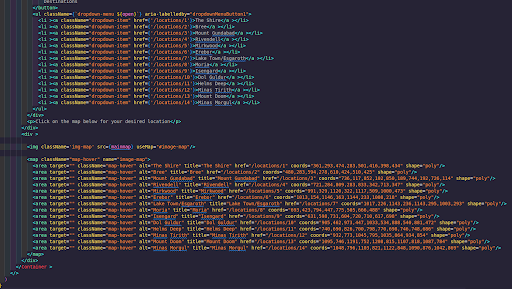
##### _Fig.14: Dropdown list added to location index_

I continued to style all the pages, paying special attention to the landing page and adding in some error functions and a ‘not found’ page. As I had a couple of hours remaining by this point, I used iFrame to pull in a website that contributed to my inspiration for this site, to the map page. This site shows the journeys of each company from Lord of The Rings and also Hobbit, which is really interesting and something I wanted to try to do if I had more time. I also managed to pull in create pages for all of the Creatures and Inhabitants as I added in a lot of background information when inputting the seeding data.

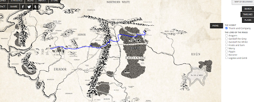
##### _Fig.15: Likes, dislikes and favourites in the location model._

## Challenges

### One:
The main big challenge I faced was the review CRUD functionality. I was unable to post any data due to error 422. I found out that it was requiring a location id and an owner id to be input at the same time. The way I initially fixed this was to create an object ‘formData’ which I spread in location id and owner id upon an Axios post request. This worked on Insomnia and on the front-end but the issue was that it isn’t a good design to ask users to fill this information in when completing forms as most users do not know their own id. The way I resolved this was by using a location id param and putting it in with the post request. However, for the owner id. After a day of working on it, I realised that the view for the review controller was missing a ‘permissions_classes = (IsAuthenticated,)’. When I added that in, it used the token which is saved upon a user’s log in that then automatically is attached when a post request is made leading me to full CRUD functionality.

### Two:
After inputting the edit profile page, along with Cloudinary, I found that it wasn’t working on updating the user’s profile image. However, I realised that this was due to a 422 error again, similar to challenge one. To ensure that an image is added, images have to be uploaded first and all fields in the ‘Edit Profile’ form must be completed before submitting or else it will not be possible.

### Three:
When creating image maps, the coordinates do not change but the size of the image may change depending on the screen size used for display. This then means that the original location I mapped would move so it would be even more difficult to understand where the clickable sections are e.g. ‘The Shire’ clickable section moved to the top left corner instead as the image size grew. As a result, I changed the original map image I wanted to use as the resolution on the original image wasn’t good enough to use for a bigger screen - causing a drop in quality. I found a good map that was in keeping with the ‘earthy’ theme I wanted to convey as Middle Earth is all about adventures.

### Four:
A big challenge I had at first was moving from MongoDB to Django in under a week. I noticed that any significant changes made to Django after migrating the models to the server would cause a large number of errors which could only be resolved with dropping the database, creating a new one and seeding new data in again. I learned to adapt to this and understand the errors I was  faced with when using Django.

### Five:
I wanted to implement a Favourites list, along with Likes and Dislikes. I have added the models and controllers into the back-end. However, I had a problem on the front-end where the number of likes weren't displaying, just the user Id. As these were stretch goals I decided to pivot - focusing on the MVP. 

### Six:
I had a problem using the map I imported with an iFrame on my ‘Maps’ page. Unfortunately, I was unable to use a HTTP website after deployment so I had to remove it. This map allowed the user to see the journeys taken by each famous character/group from the movies and the books (fig.16) which was one of the inspirations for my project. Figure 17 shows how it was prior to deployment, and figure 18 shows the result of the issue.

##### _Fig.16: LOTR project
_
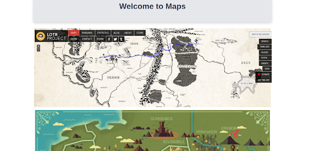
##### _Fig.17: Maps page prior to deployment_

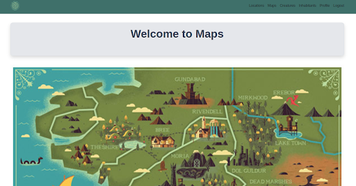
##### _Fig.18: Maps page post-deployment_

## Wins

### One:
When I initially input the functions to submit and handle adding a review, for some reason I was getting an error in my post request. I was not sure why this was as the error wasn’t clear. Through the use of console logs, I realised that the data wasn’t going through the axios request. I followed this backwards to understand why it wasn’t working and realised that one of my function for getting the token had an extra comma at the end (fig.19), which is why it wasn’t working - I had to laugh this off but I was proud of how I handled the error and located the cause. 

##### _Fig.19: Extra comma at the end of line 12 causing problems_

### Two:
I wanted to add a few extra functions that I’ve never used before. These were the capability to edit profiles and also using ‘Image Mapping’. This felt great when I managed to get these functions to work as I love to learn new ways to manipulate code.

### Three:
Getting to grips with Django was a big win for me as I found it confusing at first. However, using the ERD that I created during my planning stage made a significant difference to reduce confusion when adding in numerous apps. 

### Four:
Getting the MVP completed was a big deal for this project as I only learned Django and Python for a few days before the project began. It was a bit difficult to jump from JavaScript to Python but eventually it felt more seamless when actually starting the project.

### Five:
Managing to workout how to add the Owner and Location id to the reviews was a big win for me as it prevented achieving my MVP. It also gave me further insight into what to do next time.

## Key Learnings/Takeaways

I am far more confident in my ability to use Django now. What this project has also taught me is that my understanding of coding languages has become a lot better. I can use Git without facing difficulties.

I’m extremely proud of the fact that I created a full-stack application on my own, making use of the resources around me whilst also putting more time into the planning phase of my project - which ultimately allowed me to spend more time on the project at the end.

During the project I noticed that a lot of individuals in my class were facing difficulties so I tried to jump in when I could and help everyone else to move forward as this wasn’t a competition and I know that the frustrations can lead to the valley of despair. I was doing this for the instructor of module 3 quite a bit - to the extent where he would stop the class and mention that Ridwan would need to help him find the error again - I happily obliged. I also built on this during project 3 which is why I gained enough confidence to publicly help others during project 4. During deployment onto Heroku, the instructor split groups as he was focusing on one or two individuals/groups that needed more specialised help and I was the main source of help for the rest of the team trying to deploy and who ran into difficulties I would walk them through the steps to fix their errors. This took place over Zoom on the final day of the course.

I have started to use more conditional logic within my coding. However, I am very proud of the image map that I created.

I really enjoyed completing the styling in this project as it was all my own work. Delving into Tailwind CSS was exciting. It makes me want to explore styling more during other projects although I am also interested in exploring Material UI, which this project has given me the confidence to do so.

## Bugs

* You can’t delete comments if you aren’t the owner. However, if you aren’t the owner, you can still click into the edit button and it goes to the edit comment screen. If a non-owner edits and submits, the comment then becomes their own. I need to add conditional logic here to avoid this in the future.
* When you delete a post, if I use a useEffect to ‘getData’ again, it causes an error and so I have had to use a window.location.reload() to get the page to refresh and bypass the errors. I would like to be able to recall the new data instead of reloading the page.
* Needing to complete all fields of the edit profile to be able to submit it.

## Future Improvements

* I want to add conditional logic so that users can’t see the delete and edit buttons of the reviews unless it’s their own. I ran out of time to be able to do this.
* I wanted to be able to add new locations in but I knew this would cause problems when using image mapping.
* I also have the ability to ‘Like’, ‘Dislike’, and ‘Favourites’ in my backend but I didn’t have enough time to do this either so it would be great to be able to implement that. As I didn’t have much experience with Django either so it would have taken a little longer to implement properly.
* I would also love to add a dark mode feature to the site.
* I wanted to make my own version of the map that I imported  from the LOTR project - which didn’t work after deployment.
* I would like to make the responsiveness better.

